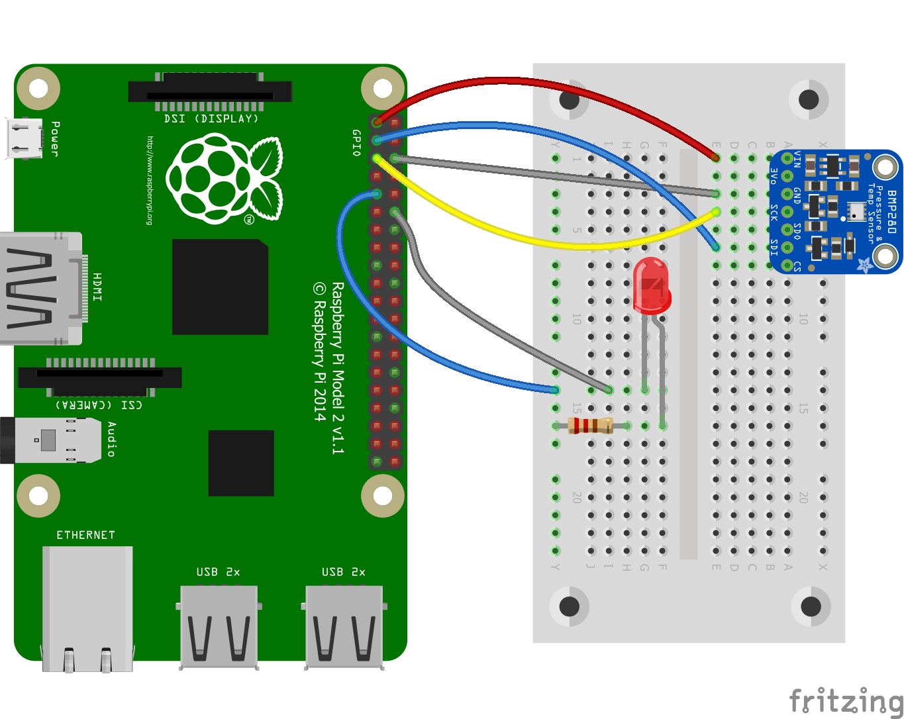
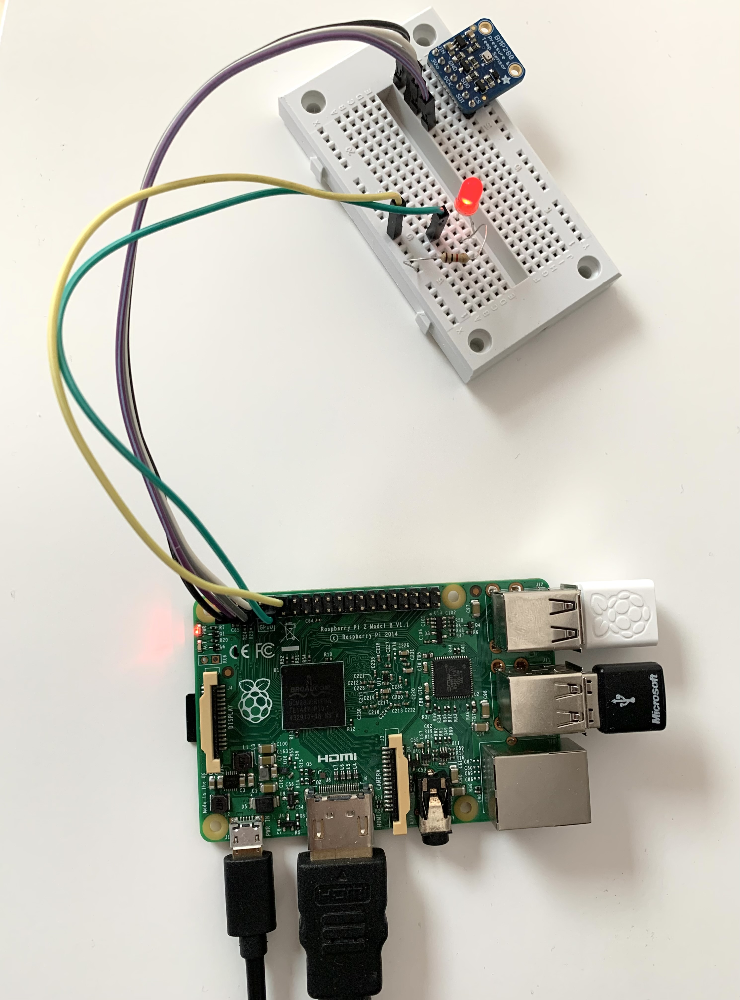
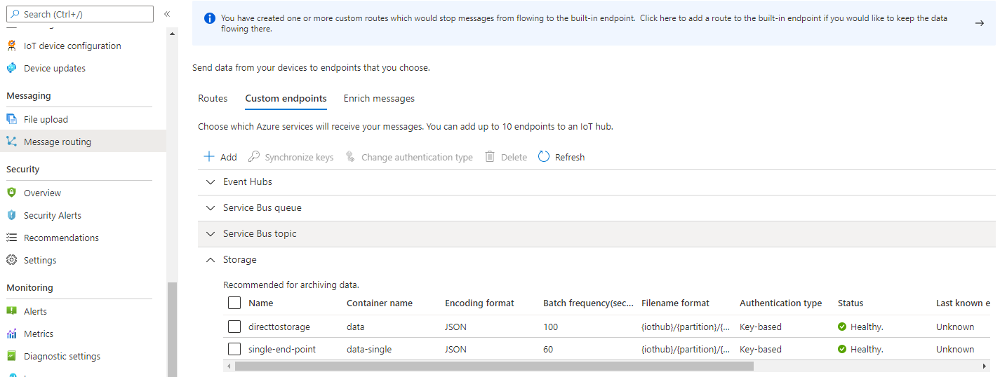
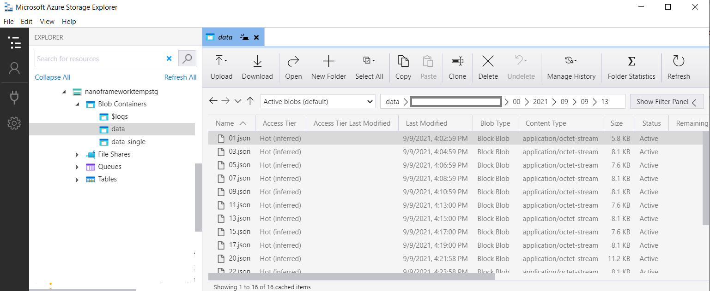

# Raspberry Pi with .NET IoT

Raspberry Pi is one of the most popular boards and now .NET IoT can be used on top of Rasberian OS to enable the writing of managed code applications.

In this sample Raspberry Pi 2 will be used, you can use above Raspberry Pi 2. This sample application includes a scenario: Every 3 seconds application reads temperature value from BMP280 sensor and turns on LED after reading the value. Then this temperature value is pushed to IoT Hub with device name and after every successful push LED will blink and turn off. Data will be handled by IoT Hub message routing and will be pushed to blob storage to store.


## Getting Started with nanoFramework

* [Getting Started Guide for .NET IoT](https://docs.microsoft.com/en-us/dotnet/iot/)
* [IoT with .NET Video Series](https://channel9.msdn.com/Series/IoT-101)
* [List of suported devices/sensors by .NET IoT](https://github.com/dotnet/iot/blob/main/Documentation/README.md)
* [.NET IoT Samples](https://github.com/dotnet/iot/blob/main/samples/README.md)
* [Install .NET on Raspberry Pi](https://www.petecodes.co.uk/explorations-in-dot-net-core-3-0-for-raspberry-pi)

## Prerequisites

* Raspberry Pi (2 or greater) with [Raspberry Pi OS installed](https://www.raspberrypi.org/documentation/computers/getting-started.html)
* BMP280 Pressure/Temperature sensor breakout
* Jumper wires
* 5 mm LED
* 330 Ω resistor
* Breadboard (optional)
* [.NET SDK](https://dotnet.microsoft.com/download) version 5.0.100 RC2 or later
* A device certificate following [create test certificate using OpenSSL](../create-certificate.md) documentation

## Prerequisite Packages

```bash
dotnet add package Iot.Device.Bindings --source https://pkgs.dev.azure.com/dnceng/public/_packaging/dotnet5/nuget/v3/index.json)
dotnet add package System.Device.Gpio --source https://pkgs.dev.azure.com/dnceng/public/_packaging/dotnet5/nuget/v3/index.json
dotnet add package Microsoft.Azure.Devices.Client --version 1.38.0
```

## Prepare the hardware

Use the hardware components to build the circuit as depicted in the following diagram:



## Pins

The following are the connections from the Raspberry Pi to the BME280 breakout:

* 3.3V to VIN OR 3V3 (shown in red)
* Ground to GND (grey)
* SDA (GPIO 2) to SDI (blue)
* SCL (GPIO 3) to SCK (yellow)
* GPIO 18 to LED anode (longer, positive lead)
* LED cathode (shorter, negative lead) to 330 Ω resistor (either end)
* 330 Ω resistor (other end) to ground

## Run the Solution

Use your Azure Subscription for following steps:

1. Make sure your [Pins](#-Pins) are correctly connected.
2. Create an IoT Hub using your Azure Subscription and leave the authentication options to default (Symmetric Key, autogenerated). You'll need IoT Hub name in the next steps in your code. You can use free tier of IoT Hub as well.

3. Create a `pfx` certificate using OpenSLL following [Create test certificate using OpenSSL](../create-certificate.md) documentation.

4. Add your certificate into root folder of the solution like `dotnet-iot/raspberry-pi.pfx` for demo purposes verified certificate in this sample is removed from repo.

5. Provide your device id and IoT Hub device connection detail into `Program.cs`. Open your solution with Microsoft Visual Studio 2019.

    ```csharp
    const string DeviceID = "<replace-with-your-device-id>";
    const string IotBrokerAddress = "<replace-with-your-iot-hub-name>.azure-devices.net";
    ```

### Building the sample

1. Starting in the folder where you unzipped the samples, go to the subfolder for this specific sample. Double-click the Visual Studio Solution (.sln) file.
2. Press Ctrl+Shift+B, or select **Build** \> **Build Solution**.
3. Make sure to click on device explorer and select your device.

The next steps depend on whether you just want to deploy the sample or you want to both deploy and run it.

### Deploying the sample

* Select Build > Deploy Solution.

### Deploying and running the sample

* To debug the sample and then run it, press F5 or select Debug >  Start Debugging.

## Remote Debugging

If you're using [VS Code](http://code.visualstudio.com) to enable remote debugging on Raspberry Pi make sure following below steps.

* [Remote debugging with VS Code on Windows to a Raspberry Pi using .NET Core on ARM](https://www.hanselman.com/blog/remote-debugging-with-vs-code-on-windows-to-a-raspberry-pi-using-net-core-on-arm)

* [How to use Windows 10's built-in OpenSSH to automatically SSH into a remote Linux machine](https://www.hanselman.com/blog/how-to-use-windows-10s-builtin-openssh-to-automatically-ssh-into-a-remote-linux-machine)

After the setup we have launch.json file to enable build and publish steps. Also we have tasks.json. file to enable remote debugging feature helps us to debug our application on Raspberry Pi on Raspberry Pi OS with .NET Core IoT.

If you don't have these files you can create `.vscode` folder in `dotnet-iot` folder and add below:

`launch.json` file:

```json
{
    "version": "0.2.0",
    "configurations": [
        {
            "name": ".NET Remote Launch",
            "type": "coreclr",
            "request": "launch",
            "preLaunchTask": "publish",
            "program": "/opt/dotnet/dotnet",
            "args": ["/home/pi/DNSensorAzureIoTHub/DNSensorAzureIoTHub.dll"],
            "cwd": "~/DNSensorAzureIoTHub",
            "stopAtEntry": false,
            "console": "integratedTerminal",
            "pipeTransport": {
                "pipeCwd": "${workspaceFolder}",
                "pipeProgram": "ssh",
                "pipeArgs": [
                    "pi@192.168.1.46"
                ],
                "debuggerPath": "~/vsdbg/vsdbg"
                }
            }]
}
```

`tasks.json` file:

```json
{
    "version": "2.0.0",
    "tasks": [
        {
            "label": "build",
            "command": "dotnet",
            "type": "process",
            "args": [
                "build",
                "${workspaceFolder}\\DNSensorAzureIoTHub.csproj"
            ],
            "problemMatcher": "$msCompile"
        },
        {
            "label": "publish",
            "type": "process",
            "dependsOn": "build",
            "presentation": {
                "reveal": "always",
                "panel": "new"
            },
            "options": {
                "cwd": "${workspaceFolder}"
            },
            "windows": {
                "command": "${cwd}\\publish.bat"
            },
            "problemMatcher": []
        }
    ]
}
```

For remote deployment and remote debugging, we need to ssh to Raspberry Pi and create folder for deployment check [IoT Series Video 6](https://channel9.msdn.com/Series/IoT-101/Hello-World-in-IoT-ie-Blinky-headless-mode-tutorial-6-of-9)

```bash
mkdir DNSensorAzureIoTHub
sudo chmod 775 ./DNSensorAzureIoTHub
```

There are two ways to publish your application to raspberry pi:

1. We have [publish.bat](publish.bat) file to publish and push our compiled code to IoT device, make sure you provide your password and ip address of your Raspberry Pi

    ```bash
    dotnet publish -r linux-arm /p:ShowLinkerSizeComparison=true
    pushd .\bin\Debug\net5.0\linux-arm\publish
    pscp -pw 1234 -v -r .\* pi@192.168.1.147:DNSensorAzureIoTHub
    popd
    ```

2. If you would like to publish manually and deploy the code manually, you can run below commands

    On windows on your project root run below commands

    ```bash
    dotnet publish -r linux-arm
    cd .\bin\Debug\net5.0\linux-arm\
    scp publish\* pi@192.168.1.109:BlinkTutorial
    ```

    Then run below commands on your Raspberry Pi using ssh

    ```bash
    cd DNSensorAzureIoTHub
    ./DNSensorAzureIoTHub
    ```

If you are using [Visual Studio 2019](https://visualstudio.microsoft.com/vs/) you can follow [Debug .NET apps on Raspberry Pi](https://docs.microsoft.com/en-us/dotnet/iot/debugging?tabs=self-contained&pivots=visualstudio) documentation

## Result



If you enable Message routing with Custom endpoint, you can save all inputs into an Azure Blob Storage

* First Create a route

    

* Create a custom endpoint to connect to your blob storage data will be save in below format:
`{iothub}/{partition}/{YYYY}/{MM}/{DD}/{HH}/{mm}` Once connection is succesfull you can see the status as healty

    

* Blob storage contains all data from IoT Hub in a container

    

and single JSON file structure looks like below:

```json
{
    "EnqueuedTimeUtc": "2021-09-10T12:31:25.1720000Z",
    "Properties": {},
    "SystemProperties": {
        "connectionDeviceId": "raspberry-pi",
        "connectionAuthMethod": "{\"scope\":\"device\",\"type\":\"sas\",\"issuer\":\"iothub\",\"acceptingIpFilterRule\":null}",
        "connectionDeviceGenerationId": "637668692473913123",
        "enqueuedTime": "2021-09-10T12:31:25.1720000Z"
    },
    "Body": "eyJUZW1wZXJhdHVyZSI6MjYuOTk3LCJQcmVzc3VyZSI6MTAwNy4yNzcsIkRldmljZUlEIjoicmFzcGJlcnJ5LXBpIn0="
}
```

Body message is encoded with Base64 format, if you decode the value, you'll retrieve the message we sent to Azure IoT Hub:

```json
{
    "Temperature": 26.997,
    "Pressure": 1007.277,
    "DeviceID": "raspberry-pi"
}
```

## References

* [Blink an LED](https://docs.microsoft.com/en-us/dotnet/iot/tutorials/blink-led)
* [Read environmental conditions from a sensor](https://docs.microsoft.com/en-us/dotnet/iot/tutorials/temp-sensor)
* [Azure SDK - Microsoft.Azure.Devices.Client](https://www.nuget.org/packages/Microsoft.Azure.Devices.Client)
